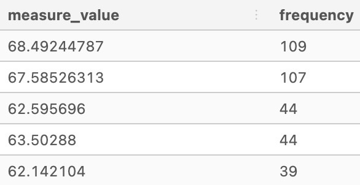
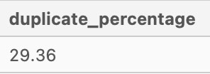

# 👨‍💻 Serious SQL Exercises

# 🔎 Data Exploration

## 📌 Select & Sort Data

### Question 1. What is the name of the category WITH the highest category_id IN the dvd_rentals.category table?

```SQL
/* Using ORDER BY DESC to sort the data and LIMIT function to show only the highest outcome */
SELECT  name
       ,category_id
FROM dvd_rentals.category
ORDER BY category_id DESC
LIMIT 1;
```


### Question 2. For the films with the longest length, what is the title of the “R” rated film with the lowest replacement_cost in dvd_rentals.film table?

```SQL
/* Filter results by 'R' rating, sort results for longest to shortest length and least to most replacement cost */
SELECT  title
       ,replacement_cost
       ,length
FROM dvd_rentals.film
WHERE rating = 'R'
ORDER BY length DESC, replacement_cost
LIMIT 1;
```


### Question 3. Who was the manager of the store WITH the highest total_sales IN the dvd_rentals.sales_by_store table?

```SQL
/* Sorting total sales in DESC and LIMIT 1 to show only the manager with highest total_sales */
SELECT  manager
       ,total_sales
FROM dvd_rentals.sales_by_store
ORDER BY total_sales DESC
LIMIT 1 -- to show only the manager with highest total_sales;
```


### Question 4. What is the postal_code of the city WITH the 5th highest city_id IN the dvd_rentals.address table?

```SQL
/* Sorting results to show CITY_ID in DESC order and LIMIT 5 to identify the 5th highest CITY_ID */
SELECT  postal_code
       ,city_id
FROM dvd_rentals.address
ORDER BY city_id DESC
LIMIT 5 -- to show only the top 5 cities WITH highest city_id;
```


In this case, the postal_code is 31390.


## 📌 Record Counts & Distinct Values

### Question 1. Which actor_id has the most number of unique film_id records in the dvd_rentals.film_actor table?

```SQL
SELECT  actor_id
       ,COUNT(DISTINCT film_id) AS unique_film
FROM dvd_rentals.film_actor
GROUP BY  actor_id
ORDER BY unique_film DESC
LIMIT 1;
```


### Question 2. How many distinct fid values are there for the 3rd most common price value in the dvd_rentals.nicer_but_slower_film_list table?

```SQL
/* Counting the distinct fid values and grouping by price, followed by ordering by descending values to identify the 3rd most common fid value */
SELECT  price
       ,COUNT(DISTINCT fid) AS fid_values
FROM dvd_rentals.nicer_but_slower_film_list
GROUP BY  price
ORDER BY fid_values DESC;
```


In this case, there are 323 distinct fid values in the 3rd most common price value of 2.99

### Question 3. How many unique country_id values exist in the dvd_rentals.city table?

```SQL
SELECT  COUNT(DISTINCT country_id)
FROM dvd_rentals.city;
```


### Question 4. What percentage of overall total_sales does the Sports category make up in the dvd_rentals.sales_by_film_category table?

```SQL
SELECT  category
       ,ROUND( 100 * total_sales::NUMERIC / SUM(total_sales) OVER (),2 ) AS percentage
FROM dvd_rentals.sales_by_film_category;
```


### Question 5. What percentage of unique fid values are in the Children category in the dvd_rentals.film_list table?

```SQL
SELECT  category
       ,ROUND( 100 * COUNT(DISTINCT fid)::NUMERIC / SUM(COUNT(DISTINCT fid)) OVER (),2 ) AS percentage
FROM dvd_rentals.film_list
GROUP BY  category
ORDER BY category;
```


## 📌 Identifying Duplicate Records

### Question 1. Which id value has the most number of duplicate records in the health.user_logs table?
```SQL
WITH groupby_counts AS (
SELECT
    id,
    log_date,
    measure,
    measure_value,
    systolic,
    diastolic,
    COUNT(*) AS frequency
  FROM health.user_logs
  GROUP BY
    id,
    log_date,
    measure,
    measure_value,
    systolic,
    diastolic)
SELECT
  id,
  SUM(frequency) AS total_duplicate_rows
FROM groupby_counts
WHERE frequency > 1
GROUP BY id
ORDER BY total_duplicate_rows DESC
LIMIT 10;
```


### Question 2. Which log_date value had the most duplicate records after removing the max duplicate id value from question 1?
```SQL
WITH groupby_counts AS(
SELECT
  id,
  log_date,
  measure,
  measure_value,
  systolic,
  diastolic,
  COUNT(*) AS groupby_frequency
FROM health.user_logs
WHERE id != '054250c692e07a9fa9e62e345231df4b54ff435d'
GROUP BY
  id,
  log_date,
  measure,
  measure_value,
  systolic,
  diastolic)
SELECT
  log_date,
  SUM(groupby_frequency) AS frequency
FROM groupby_counts
WHERE groupby_frequency > 1
GROUP BY log_date
ORDER BY frequency DESC
LIMIT 10;
```


### Question 3. Which measure_value had the most occurences in the health.user_logs value when measure = 'weight'?
```SQL
SELECT
  measure_value,
  COUNT(*) AS frequency
FROM health.user_logs
WHERE measure = 'weight'
GROUP BY measure_value
ORDER BY frequency DESC
LIMIT 5;
```


### Question 4. How many single duplicated rows exist when measure = 'blood_pressure' in the health.user_logs? How about the total number of duplicate records in the same table?
```SQL
WITH groupby_counts AS (
  SELECT
    id,
    log_date,
    measure,
    measure_value,
    systolic,
    diastolic,
    COUNT(*) AS frequency
  FROM health.user_logs
  WHERE measure = 'blood_pressure'
  GROUP BY
    id,
    log_date,
    measure,
    measure_value,
    systolic,
    diastolic)
SELECT
  COUNT(*) as single_duplicate_rows,
  SUM(frequency) as total_duplicate_records
FROM groupby_counts
WHERE frequency > 1;
```


### Question 5. What percentage of records measure_value = 0 when measure = 'blood_pressure' in the health.user_logs table? How many records are there also for this same condition?
```SQL
WITH all_measure_values AS (
  SELECT
    measure_value,
    COUNT(*) AS total_records,
    SUM(COUNT(*)) OVER () AS overall_total
  FROM health.user_logs
  WHERE measure = 'blood_pressure'
  GROUP BY 1
)
SELECT
  measure_value,
  total_records,
  overall_total,
  ROUND(100 * total_records::NUMERIC / overall_total, 2) AS percentage
FROM all_measure_values
WHERE measure_value = 0;
```


### Question 6. What percentage of records are duplicates in the health.user_logs table?
```SQL
WITH groupby_counts AS (
  SELECT
    id,
    log_date,
    measure,
    measure_value,
    systolic,
    diastolic,
    COUNT(*) AS frequency
  FROM health.user_logs
  GROUP BY
    id,
    log_date,
    measure,
    measure_value,
    systolic,
    diastolic
)
SELECT
  ROUND(
    100 * SUM(CASE
        WHEN frequency > 1 THEN frequency - 1 -- Need to subtract 1 from the frequency to count actual duplicates!
        ELSE 0 END
    )::NUMERIC / SUM(frequency),
    2
  ) AS duplicate_percentage
FROM groupby_counts;
```

