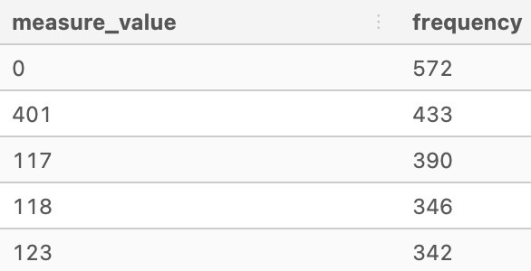
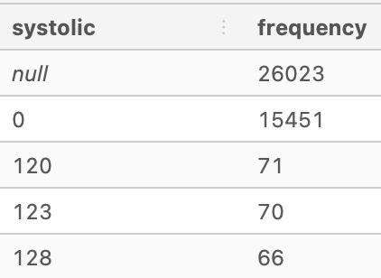
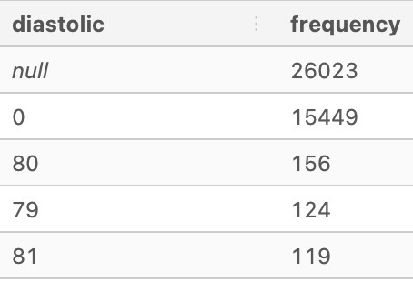

# 🔎 Data Exploration

## 🧼 Data Inspection and Cleaning

For context, this real world messy dataset captures data taken from individuals logging their measurements via an online portal throughout the day.

For example, multiple measurements can be taken on the same day at different times, but certain information is missing as the log_date column does not show timestamp values!

The dataset consists of two tables - **user_logs** and **users**. For this section the **user_log** table was used.

| Field | Type |
| --- | --- |
| id | varchar |
| log_date | date |
| measure | text |
| measure_value | numeric |
| systolic | numeric |
| diastolic | numeric |

Following are the activities carried out to deal with the messy dataset:

## 📌 Data Inspection

Before dealing with duplicate data it is important to understand the dataset by carrying out inspection.

```SQL
SELECT *
FROM health.user_logs
LIMIT 10;
```


### Record Counts

Checking the count of the data

```SQL
SELECT COUNT(*)
FROM health.user_logs;
```


### Unique Column Counts

Using the COUNT DISTINCT function to identify the unique ID values

```SQL
SELECT COUNT(DISTINCT id)
FROM health.user_logs;
```


### Single Column Frequency Counts

Inspecting the **measure** column to understand the frequency of measure values

```SQL
SELECT
  measure,
  COUNT(*) AS frequency,
  ROUND(
    100 * COUNT(*) / SUM(COUNT(*)) OVER (), 2)
    AS percentage
  FROM health.user_logs
  GROUP BY measure
  ORDER BY frequency DESC;
  ```
  
  
  Inspecting the **id** column as well
  
  ```SQL
  SELECT
    id,
    COUNT(*) AS frequency,
    ROUND(
      100 * COUNT(*) / SUM(COUNT(*)) OVER(), 2) AS percentage
    FROM health.user_logs
    GROUP BY id
    ORDER BY percentage DESC
    LIMIT 10;
  ```
  

  
  ## 📌 Individual Column Distributions
  
  Identifying the most recurring values within each column
  
  ### Measure Column
  
  ```SQL
  SELECT
  measure_value,
  COUNT(*) AS frequency
FROM health.user_logs
GROUP BY measure_value
ORDER BY frequency DESC
LIMIT 5;
```


### Systolic Column

```SQL
SELECT
  systolic,
  COUNT(*) AS frequency
FROM health.user_logs
GROUP BY systolic
ORDER BY frequency DESC
LIMIT 5;
```


### Diastolic Column

```SQL
SELECT
  diastolic,
  COUNT(*) AS frequency
FROM health.user_logs
GROUP BY diastolic
ORDER BY frequency DESC
LIMIT 5;
```


### Deeper dive into specific values

As it can be seen that there are many 0 values there for the "measure_value" field and null values for both "systolic" and "diastolic" columns.

To inspect these rows a bit further - a use of **WHERE** filter will be utilized to check if this only happens for certain measure values when the condition measure_value = 0 is met and the systolic and diastolic columns are null.

```SQL
SELECT
  measure,
  COUNT(*)
FROM health.user_logs
WHERE measure_value = 0
GROUP BY measure
LIMIT 5;
```


When comparing the results with the frequency percentage calculated above it can be seen that most "measure_value = 0" are occurring when the "measure = blood_pressure" as 562 out of 2417 entries are 0. While "measure = blood_glucose" has 8 "measure_value = 0" values out of 38692 entries and "measure = weight" has 2 entries with "measure_value = 0" out of 2782 frequency value.

Digging in further for "measure = blood_pressure" to inspect the values:

```SQL
SELECT *
FROM health.user_logs
WHERE measure_value = 0
AND measure = 'blood_pressure'
LIMIT 10;
```


It is understood that when "measure_value = 0" then values for "systolic" and "diastolic" are captured with valid information.

But what if "measure_value != 0", the query was altered to obtain the results for further inspection:

```SQL
SELECT *
FROM health.user_logs
WHERE measure_value != 0
AND measure = 'blood_pressure'
LIMIT 10;
```


It is apparent that "systolic" values are sometimes recorded as "measure_value" which is sometimes recorded as 0.

The final step in this inspection stage would be to analyze the NULL values in "systolic" and "diastolic" columns using the WHERE statement:

```SQL
SELECT
  measure,
  COUNT(*)
FROM health.user_logs
WHERE systolic IS NULL
GROUP BY measure
LIMIT 10;
```

Looking at the result it is confirmed that there are NO-NULL records for "systolic" only when "measure = blood_pressure".

```SQL
SELECT
  measure,
  COUNT(*)
FROM health.user_logs
WHERE diastolic IS NULL
GROUP BY measure
LIMIT 10;
```


The results confirm the observations.
