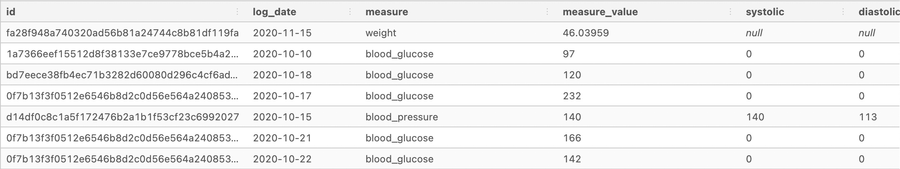
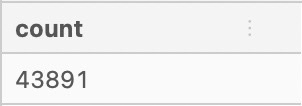
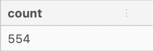
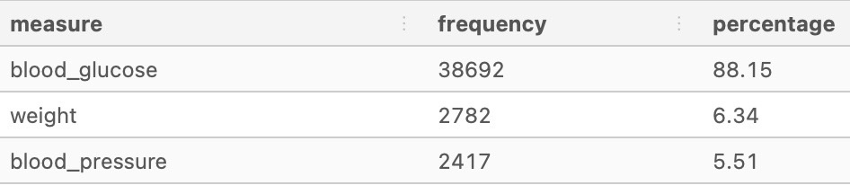
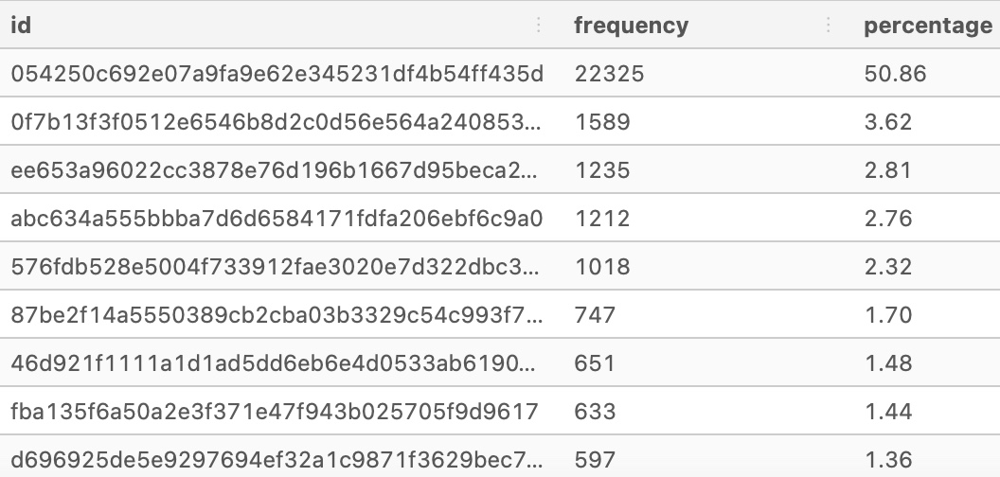

# 🔎 Data Exploration

## 🧼 Data Inspection and Cleaning

For context, this real world messy dataset captures data taken from individuals logging their measurements via an online portal throughout the day.

For example, multiple measurements can be taken on the same day at different times, but certain information is missing as the log_date column does not show timestamp values!

The dataset consists of two tables - **user_logs** and **users**. For this section the **user_log** table was used.

| Field | Type |
| --- | --- |
| id | varchar |
| log_date | date |
| measure | text |
| measure_value | numeric |
| systolic | numeric |
| diastolic | numeric |

Following are the activities carried out to deal with the messy dataset:

### Data Inspection

Before dealing with duplicate data it is important to understand the dataset by carrying out inspection.

```SQL
SELECT *
FROM health.user_logs
LIMIT 10;
```


### Record Counts

Checking the count of the data

```SQL
SELECT COUNT(*)
FROM health.user_logs;
```


### Unique Column Counts

Using the COUNT DISTINCT function to identify the unique ID values

```SQL
SELECT COUNT(DISTINCT id)
FROM health.user_logs;
```


### Single Column Frequency Counts

Inspecting the **measure** column to understand the frequency of measure values

```SQL
SELECT
  measure,
  COUNT(*) AS frequency,
  ROUND(
    100 * COUNT(*) / SUM(COUNT(*)) OVER (), 2)
    AS percentage
  FROM health.user_logs
  GROUP BY measure
  ORDER BY frequency DESC;
  ```
  
  
  Inspecting the **id** column as well
  
  ```SQL
  SELECT
    id,
    COUNT(*) AS frequency,
    ROUND(
      100 * COUNT(*) / SUM(COUNT(*)) OVER(), 2) AS percentage
    FROM health.user_logs
    GROUP BY id
    ORDER BY percentage DESC
    LIMIT 10;
  ```
  
  
  ### ABC
